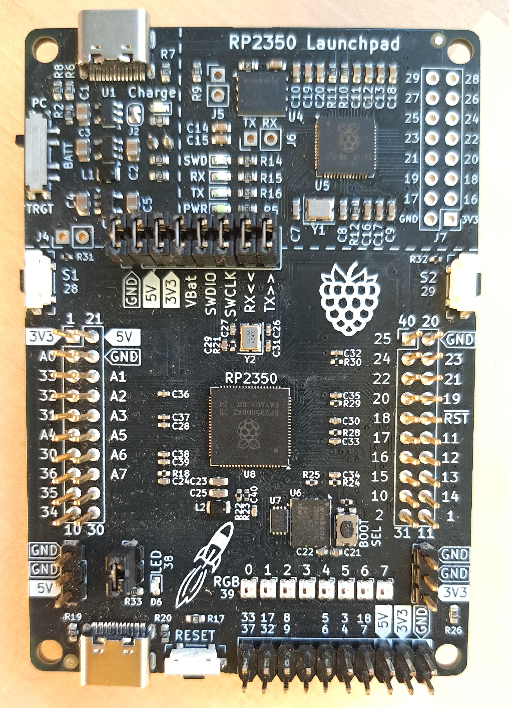
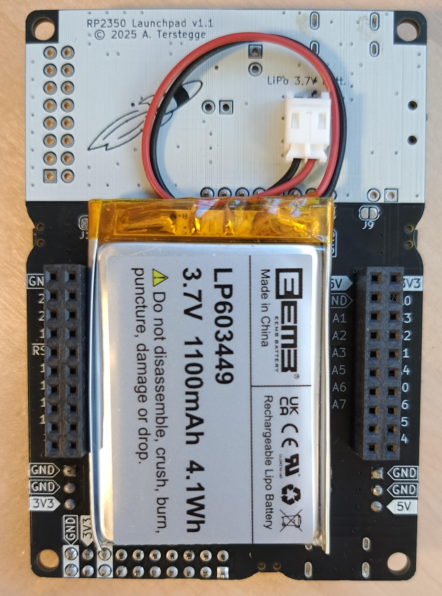

# RP2350B-Launchpad PCB

This repository contains the KiCad design files for a TI-style Launchpad
board with the RP2350B microcontroller. The board has the following
features:

- RP2350 microcontroller with 48 GPIOs (8 of these can be used as ADC inputs)
- 8MB of flash and 8MB of PSRAM
- A single red LED (connected to GPIO 38). Can be disabled with a jumper.
- Eight WS2812 RGB LEDs (connected to GPIO 39)
- A reset button
- Two user buttons (S1/S2 connected to GPIO 28/29)
- USB-C socket connected to the target RP2350
- A small button to let the RP2350 start in mass-storage mode for programming.
  This is usually not needed when using the debugger.
- A target isolation jumper block which can be used to completely disconnect
  the targer from power supply and debugging signals.
- A RP2040-based picoprobe debug probe which also forwards UART traffic from
  the target to the connected PC. Three LEDs signal UART RX/TX activity
  and SWD activity.
- Additional header for unused GPIOs of the picoprobe RP2040, which could
  be used for logic analyzer inputs or other purposes.
- Flexible power supply by either using
  * the upper USB-C socket connected to the debugger
  * a connected 3,7V LiPo battery
  * the lower USB-C socket connected to the target

  These three options are selectble by a small switch
- Integrated LiPo charger. The battery will be charged when the board is
  powered from the upper USB-C socket. Charging is signalled by a LED.
- In all power scenarios, 3.3V and 5V are available. When using the
  battery as the power source, the 5V supply is generated by a step-up
  converter.

  A third option uses 

- Flexible power supply: The board can be powered either by the upper
  or lower USB-C socket. The first one also supplied the debugger and
  the LiPo charger. The lower one is 
- On-board picoprobe debugger using a RP2040. 
  SWD protocol and 
 RP2350B microcontroller
- 

features a build-in picoprobe
debugger (using a RP2040), which allows debugging of code on the target
using of the signals UART RX/TX and SWD activity with 3 LEDs. The unused
GPIO pins of the picoprobe are connected to a header, which could be used
in the future for more functionality like a simple logic analyzer etc.

The target RP2350B controller has 2 connected pushbuttons, one normal LED and
8 WS2812-2020 LEDs as input/output. Some signals are also available on a
horizonal header at the lower end of the PCB, which is used to connect WLAN or
Bluetooth boards like WifiTick. The RP2350B uses a 8 MiB flash chip and an
additional 8 MiB PSRAM chip. The board also has a button to enable programming
via the target USB port (mass storage device). Normally this button is
not needed, because all programming and debugging of the target is performed
via the picoprobe using openocd and gdb.

The board also contains a LiPo-charger to enable battery-powered projects.

Why was this board designed? I have been using the MSP432 Launchpad from TI for
quite a while in university classes teaching microcontroller technology.
Unfortunately TI has stopped producing all MSP432-related products. Still we
have purchased lots of TI boosterpack-boards like the Educational Boosterpack MK II.
The be able to use these Boosterpacks also in the future, a new Launchpad had
to be found. The RP2350B is a very interesting microcontroller, and, what is
quite important for educational purposes, it has excellent documentation.
So this board came to life. As far as I know this is the only RP2350 board
including a picoprobe debugger.

